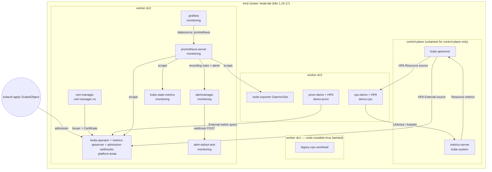

# keda-labs — Lab Overview

End-to-end reference for the kind-based KEDA experimentation lab: architecture, components, dashboards, alerts, SLOs, and how to drive the demo.

Last updated: 2026-05-15

---

## 1. Overview

`keda-labs` is a reproducible Kubernetes lab built on `kind` that stands up KEDA 2.16.1 with full production-grade observability — Prometheus + Alertmanager + kube-state-metrics + node-exporter + Grafana 11 — plus three demo workloads that exercise every metric path KEDA emits. It is targeted at platform engineers and SREs who need to learn, demo, or regression-test KEDA in an environment that mirrors what a real cluster looks like (HA replicas, cert-manager mTLS, zone topology, ServiceMonitor-equivalent label semantics) without depending on a cloud account.

High-level features:

- 1 control-plane + 3 worker `kind` cluster on Kubernetes `1.24.17`, with workers labeled `topology.kubernetes.io/zone=dc1|dc2|dc3` for zone-spread demos.
- One worker tainted `node-routable=true:NoSchedule` to enforce that KEDA control-plane components stay off "routable" workload nodes.
- KEDA `2.16.1` with operator + metrics-apiserver + admission-webhooks Prometheus endpoints all enabled.
- cert-manager `v1.16.2` issues KEDA's webhook / metrics-apiserver TLS certs from a self-signed CA (replaces KEDA's in-operator generator).
- Prometheus + Alertmanager pre-wired to a stdout webhook sink so the alert pipeline is observable end-to-end with no SaaS dependency.
- Grafana provisioned via ConfigMap with five lab-core dashboards (monitoring stack, KEDA operations, workload inventory, workload detail, workload CPU deep view) plus the remotely-fetched KEDA Deprecations dashboard from the standalone keda-deprecation-webhook chart.
- Recording + multi-window multi-burn-rate SLO alert rules for the KEDA control plane (reconcile success, operator UP).
- Two living demo workloads (resource trigger and Prometheus external trigger) plus a "legacy" workload using KEDA's deprecated CPU-trigger form.
- One-command install (`make up`), parallel image prepull, idempotent re-installs, and verification scripts.

---

## 2. Architecture



### Trigger data flows

```
RESOURCE TRIGGER (cpu/memory)
  ScaledObject(type=cpu) -> KEDA-managed HPA (Resource source)
                                |
                                v
                           metrics-server -> kube-apiserver -> HPA controller -> Deployment scale

EXTERNAL TRIGGER (prometheus, kafka, ...)
  ScaledObject(type=prometheus) -> KEDA-managed HPA (External source)
                                          |
                                          v
                            kube-apiserver -> external.metrics.k8s.io
                                          |
                                          v
                            keda-operator-metrics-apiserver
                                          |
                              (gRPC over mTLS, certs from cert-manager)
                                          v
                                    keda-operator
                                          |
                                          v
                                  trigger source (Prometheus)
```

### Alert flow

```
Prometheus scrape -> recording rules (5m/1h/6h/7d ratios)
                  -> alerting rules (instant + multi-window burn rate)
                  -> Alertmanager (route by alertname,severity)
                  -> webhook receiver -> alert-stdout-sink Pod
                                          (kubectl logs to inspect)
```

---

## 3. Lab features

**HA-aware Prometheus scrape config.** The chart renders Service-level `prometheus.io/scrape=true` annotations on KEDA's three Services and the upstream `kubernetes-service-endpoints` job picks them up. KEDA's chart additionally hardcodes a pod-level scrape annotation on the metrics-apiserver Deployment, which would double-count via `kubernetes-pods`; `lab/keda/values.yaml` overrides that pod annotation back to `"false"` so each component is scraped exactly once. Per-pod aggregation keeps HA-replica counts accurate.

**cert-manager-issued mTLS for KEDA.** `lab/keda/values.yaml` sets `certificates.autoGenerated=false` and `certificates.certManager.enabled=true`; the chart renders an `Issuer` plus `Certificate` for the webhook + metrics-apiserver, and the cert-manager controller reconciles them. Replaces KEDA's in-operator self-signer, which is what production deployments do anyway.

**Node routability check.** One worker is labeled `node-routable=true` and tainted `node-routable=true:NoSchedule`. A dashboard stat panel ("On routable nodes") asserts the count of KEDA pods scheduled on that node is zero — drift here surfaces toleration regressions.

**1-command install.** `make up` runs prereq checks, creates the cluster, labels zones, prepulls images, installs the monitoring stack and KEDA, deploys the demos, and verifies the result. Re-running individual `make install-*` targets is idempotent.

**Provisioned Grafana via ConfigMap.** `lab/scripts/install-grafana.sh` renders the `grafana-datasources`, `grafana-dashboard-providers`, and `grafana-dashboards` ConfigMaps, then `helm upgrade --install`s Grafana with `extraConfigmapMounts`. After ConfigMap updates the script also `rollout restart`s Grafana — Grafana's file provisioner reads at startup, and ConfigMap projection lag means a `kubectl create cm` alone is not visible to a running pod (see "Known caveats" below).

**SLO platform.** Recording rules at 5m/1h/6h/7d windows for two SLIs (reconcile success, operator UP), wired to multi-window multi-burn-rate alerts (see Section 6).

**Lab-friendly alert sink.** `lab/manifests/alert-stdout-sink.yaml` deploys a 30-line Python HTTP server in the `monitoring` namespace that pretty-prints every Alertmanager webhook payload to stdout. `kubectl logs deploy/alert-stdout-sink -n monitoring -f` is the demo's "alert console".

**Image prepull.** `lab/scripts/prepull-images.sh` renders every chart with the same values the installer uses, dedupes the resulting image references, resolves per-arch digests serially (avoids docker.io throttling under parallelism), pulls in parallel, and `kind load`s into the cluster. Workaround for the multi-arch + `ctr import` mismatched-rootfs error common on Apple Silicon.

**Legacy demo + namespace rename.** A `legacy-cpu` namespace (`prodsuite=legacy`) hosts a workload using the deprecated `metadata.type: Utilization` form on a CPU trigger. KEDA 2.16 still accepts it (with a warning); 2.18 will reject it. It is the known offender the planned `keda-deprecation-webhook` is designed to inventory and block. The `keda` namespace was renamed `platform-keda` to align with internal naming and to make the `prodsuite=Platform` mapping read naturally.

---

## 4. Components in detail

### KEDA

- **Namespace:** `platform-keda`
- **Version:** chart `2.16.1`, Helm release `keda`
- **Install script:** `lab/scripts/install-keda.sh` (runs `install-cert-manager.sh` first)
- **Values:** `lab/keda/values.yaml`
- **Key decisions:**
  - `prometheus.<operator|metricServer|webhooks>.enabled=true` exposes `:8080/metrics` on each component.
  - `podAnnotations.metricsAdapter.prometheus.io/scrape="false"` overrides a chart hardcode that would double-scrape the metrics-apiserver via the `kubernetes-pods` job.
  - `certificates.autoGenerated=false` + `certificates.certManager.enabled=true` routes TLS through cert-manager.
  - Namespace is auto-labeled `prodsuite=Platform` so the dashboard `prodsuite` template variable picks it up.

### cert-manager

- **Namespace:** `cert-manager`
- **Version:** `v1.16.2` (configurable via `CERT_MANAGER_VERSION` env var)
- **Install script:** `lab/scripts/install-cert-manager.sh` (helm chart with `crds.enabled=true`)
- **Why it's here:** KEDA's chart, with the values above, renders a self-signed `Issuer` plus `Certificate` resources that require the cert-manager CRDs and controller to exist before `helm install keda` runs.

### Prometheus + Alertmanager + exporters

- **Namespace:** `monitoring`
- **Chart:** `prometheus-community/prometheus` (server + alertmanager + node-exporter + kube-state-metrics + configmap-reload)
- **Install script:** `lab/scripts/install-prometheus.sh`
- **Values:** `lab/prometheus/values.yaml` (562 lines — recording rules, alerting rules, scrape relabel)
- **Scrape config:** Default `kubernetes-service-endpoints` job picks up KEDA via the chart's Service annotations. A `metric_relabel_configs` block on that job rewrites KEDA-workload-metric labels (`keda_resource_*`, `keda_scaled_object_*`, `keda_scaler_*`) to ServiceMonitor semantics: `namespace=platform-keda`, `exported_namespace=<scaledobject ns>`. Other scrape targets (cAdvisor, kube-state-metrics) are untouched.
- **Recording / alerting rules:** Six rule groups (`stdout-sink`, `keda-platform-slo`, `keda-control-plane`, `keda-deprecations`, `keda-workloads`, `lab-demo`) organized into a three-tier audience-aware structure. See Section 6.
- **Alertmanager:** Single route, `receiver: stdout-sink`, webhook to `alert-stdout-sink.monitoring.svc.cluster.local:8080/`. Group by `alertname,severity`; group_wait 10s, repeat 5m.
- **kube-state-metrics:** Uses local `dhi.io/kube-state-metrics:2` image (Docker Hardened Image, preloaded into kind). `metricLabelsAllowlist` exposes node labels `topology.kubernetes.io/zone`, `kubernetes.io/hostname`, `node-routable`, and namespace label `prodsuite`.
- **node-exporter:** DaemonSet on every node, default config.
- **Force-reload:** install script `rollout restart`s the prometheus-server deployment after `helm upgrade` to bypass a configmap-reload sidecar race that occasionally serves the previous configmap snapshot.

### Grafana

- **Namespace:** `monitoring`
- **Version:** image tag `11.1.0`
- **Install script:** `lab/scripts/install-grafana.sh`
- **Values:** `lab/grafana/values.yaml`
- **Provisioning:** Three ConfigMaps (`grafana-datasources`, `grafana-dashboard-providers`, `grafana-dashboards`) mounted via `extraConfigmapMounts`; the dashboards file-provider points to `/var/lib/grafana/dashboards/keda-lab` and surfaces a `KEDA Lab` folder.
- **Datasource:** Single Prometheus datasource with stable UID `prometheus`. Adding a second datasource entry to `lab/grafana/provisioning/datasources/prometheus.yaml` makes it appear in every dashboard's `Datasource` template variable.
- **Auth:** `admin` / `admin` (configurable via `GRAFANA_ADMIN_USER` / `GRAFANA_ADMIN_PASSWORD` env vars).
- **Persistence:** disabled (lab is ephemeral).

### Alertmanager + stdout sink

- **Sink manifest:** `lab/manifests/alert-stdout-sink.yaml` (Deployment + Service + ConfigMap with a stdlib-only Python HTTP server)
- **Image:** `python:3.12-alpine`
- **Behavior:** every `POST` is JSON-pretty-printed between `=` separators; non-JSON bodies are echoed raw; always responds 200 to prevent Alertmanager retry storms.
- **Auto-applied** by `lab/scripts/install-prometheus.sh` after the helm upgrade — wired into `make up`.

### Demo workloads

- **`demo-cpu` namespace, `prodsuite=Demo`** — `cpu-demo` Deployment with a CPU `ScaledObject` (resource trigger, 50% utilization, max 6 replicas). Drives the HPA-Resource path.
- **`demo-prom` namespace, `prodsuite=Demo`** — `prom-demo` Deployment with a Prometheus `ScaledObject` (external trigger). The trigger query reads `cpu-demo`'s HPA replica count, so a single `make load-test` exercises both trigger families. Drives the adapter↔operator gRPC path.
- **`legacy-cpu` namespace, `prodsuite=legacy`** — `cpu-legacy` Deployment with the deprecated `metadata.type: Utilization` form. Known offender for the planned deprecation webhook.

---

## 5. Dashboards

Five dashboards live in `lab/grafana/dashboards/` (lab core) + the KDW dashboard (fetched from the [wys1203/keda-deprecation-webhook](https://github.com/wys1203/keda-deprecation-webhook) standalone repo at install time) and are provisioned into the **KEDA Lab** Grafana folder. The webhook itself is now external; `make install-webhook` installs it via Helm from the standalone repo. Each exposes three top-bar template variables: `Datasource`, `Prodsuite`, `Namespace`. The Workload Detail dashboard additionally exposes `ScaledObject` (single-select).

### `monitoring-stack` — Monitoring Stack

- **UID:** `monitoring-stack`
- **Audience:** Operator (verifying Prometheus health, scrape inventory)
- **Purpose:** First sanity check after a fresh install. Confirms Prometheus is up, scraping the right number of targets, nodes are reachable, and no targets are stuck `down`.
- **Panels:** Healthy/down scrape targets (stat), Kubernetes nodes, Running pods, Healthy targets by job (timeseries), Pods by phase, Node CPU used, Node memory used, Active target health (table).

### `keda-operations` — KEDA Operations

- **UID:** `keda-operations`
- **Audience:** KEDA platform / SRE (control-plane health, gRPC plumbing, scaler latency, cert expiry)
- **Purpose:** All in-band signals for the KEDA control plane. 43 panels grouped into rows:
  - **Control plane health** — KEDA Operator UP, Metrics API Server UP, Admission Webhooks UP, KEDA Version, Operator leader status, "On routable nodes" guard, Admission webhook p99 latency.
  - **Metrics API server** — request rate by code, p99 latency.
  - **Resources managed** — ScaledObjects, ScaledJobs, TriggerAuthentications, Paused ScaledObjects, Trigger types in use, Resource counts over time, CRD churn rate.
  - **Workload outcomes** — KEDA-managed HPAs replica state (filtered by `keda-hpa-.*` regex).
  - **Reconcile health** — ScaledObject error rate, controller reconcile errors, reconcile duration p50/p95/p99, active reconcile workers.
  - **Adapter ↔ Operator gRPC** — server / client handled rate, server handling latency p50/p95/p99, in-flight messages diff.
  - **External scalers** — active scalers, scaler metrics value, scaler fetch latency, scaler errors rate.
  - **Workqueue** — depth and add rate.
  - **KEDA component resource usage** — CPU/RAM per pod.
  - **Cert-manager certificates** — min days to expiry, certs not Ready, per-cert expiry table, days-to-expiry over time.

### `keda-workload-inventory` — KEDA Workload Inventory

- **UID:** `keda-workload-inventory`
- **Audience:** Workload owner (find their ScaledObjects); also platform on triage ("where is metrics-api used?")
- **Purpose:** Scaler-agnostic catalog of every ScaledObject in scope. Source queries combine `kube_horizontalpodautoscaler_*` (covers cpu/memory + external) with `keda_scaled_object_*` (paused / errors). Works for all 7 production trigger types in use (cpu, memory, prometheus, nats-jetstream, redis, cron, metrics-api).
- **Panels (8):** Total SOs + Pinned-at-Max + Paused + With-Errors-1h (4 stats); Main Inventory Table with data-link to Detail; Trigger Type Distribution (pie); Active External Scalers timeline; Recent Errors table.
- **Click-through:** Click a row's ScaledObject column to drill into `keda-workload-detail`.

### `keda-workload-detail` — KEDA Workload Detail

- **UID:** `keda-workload-detail`
- **Audience:** Workload owner (one SO drilldown)
- **Purpose:** Pick `Namespace` and `ScaledObject` from template variables. Generic per-SO view via the same HPA + KEDA metrics — works for all trigger types.
- **Panels (12):** Current/Desired/Min/Max/External Triggers Active/Paused (6 stats); Replicas over time; Metric Value vs Threshold; Trigger Detail table; Scaler Errors / Fetch Latency p95 / Active State (3 timeseries — populated for external scalers; "No data" for cpu/memory-only SOs, which is correct since the resource-trigger path bypasses KEDA's adapter).

### `keda-workload-cpu` — KEDA Workload — CPU Deep View

- **UID:** `keda-workload-cpu`
- **Audience:** Workload owner with cpu/memory triggers (deeper view than generic Detail)
- **Purpose:** Adds per-pod cAdvisor CPU + zone-spread on top of the generic Workload Detail signals. Useful when troubleshooting cpu trigger behavior specifically. Renamed from the original `keda-demo-cpu-scaling` dashboard (queries unchanged — already use `$namespace` template variable, default bumped to `All`).
- **Panels:** Replicas (current vs desired vs min vs max, "At max for 10m?" indicator, Pods Pending, Replicas over time); CPU (per-pod CPU usage in cores, CPU utilization vs trigger threshold); Pods by phase + zone (using `topology.kubernetes.io/zone`); Active alerts table.

---

## 6. Alerts catalog

All rules live in `lab/prometheus/values.yaml` under `serverFiles.alerting_rules.yml.groups`. The ruleset is organized into a **three-tier audience-aware structure** — see the design spec at `docs/superpowers/specs/2026-05-12-keda-platform-alerts-design.md` for the full rationale.

Every alert carries four labels:

- `severity`: `critical` (pager) / `warning` (ticket) / `info` (dashboard-only, no routing)
- `tier`: `"1"` (SLO burn-rate) / `"2"` (component cause) / `"3"` (observation)
- `component`: one of `keda-operator`, `keda-metrics-apiserver`, `keda-admission-webhooks`, `keda-deprecation-webhook`, `cert-manager`, `workload`
- `audience`: `platform` (KEDA platform team) / `workload-owner` (tenant team) / `lab-only` (excluded from production rollout)

### Tier overview

| Group | Tier | Audience | Count |
|---|---|---|---|
| `keda-platform-slo` | 1 (SLO burn-rate) | platform | 4 |
| `keda-control-plane` | 2 (component cause) | platform | 11 |
| `keda-deprecations` | 2 + 3 (mixed) | platform / workload-owner | 3 |
| `keda-workloads` | 3 (observation) | workload-owner | 4 |
| `lab-demo` | 3 (observation) | lab-only | 2 |

24 alerts total. Tier 3 (`severity: info`) alerts are never pageable.

### Tier 2 — Component cause (`keda-control-plane`, `keda-deprecations`)

11 alerts in `keda-control-plane` plus 2 in `keda-deprecations`. All `audience: platform`.

| Name | Group | Severity | Trigger condition |
| --- | --- | --- | --- |
| `KedaOperatorDown` | keda-control-plane | critical | No healthy operator scrape sample for 5m |
| `KedaMetricsApiServerDown` | keda-control-plane | critical | No healthy metrics-apiserver scrape for 5m |
| `KedaAdmissionWebhooksDown` | keda-control-plane | warning | No healthy admission-webhook scrape for 10m |
| `KedaAdmissionWebhookLatencyHigh` | keda-control-plane | warning | p99 of `controller_runtime_webhook_latency_seconds` > 1s sustained 10m — admission slow before timeout |
| `KedaContainerCpuThrottling` | keda-control-plane | warning | KEDA container CPU throttled >10% of CFS periods sustained 10m |
| `KedaContainerMemoryNearLimit` | keda-control-plane | warning | Working set > 90% of memory limit sustained 15m — pre-OOMKill warning |
| `KedaWorkqueueBacklog` | keda-control-plane | warning | Workqueue depth > 25 sustained 10m |
| `KedaAdapterToOperatorGrpcErrors` | keda-control-plane | warning | gRPC returning non-OK code sustained 5m |
| `KedaAdapterToOperatorGrpcSilence` | keda-control-plane | critical | Sustained traffic 15m ago AND zero traffic now, holds 5m |
| `KedaOperatorLeaderChurn` | keda-control-plane | warning | Leader changed >2 times in 10m |
| `KedaCertNearExpiry` | keda-control-plane | warning | Any KEDA-namespace cert expires in <14d, holds 1h — cert-manager renewal failed |
| `KedaDeprecationWebhookDown` | keda-deprecations | critical | KDW webhook unreachable 5m |
| `KedaDeprecationConfigReloadFailing` | keda-deprecations | warning | KDW CM parse failing 5m (was 0m — bumped to suppress single transient parse errors) |

The `KedaAdapterToOperatorGrpcSilence` precondition (`> 0.01` in the offset window) ensures fresh clusters that have never run an external trigger never trip the alert. Catches mTLS expiry, wedged operator goroutines, or network partitions — failures that don't surface as non-OK codes because the call never lands.

The two new alerts (`KedaAdmissionWebhookLatencyHigh` and `KedaContainerMemoryNearLimit`) fill platform-coverage gaps the SLO can't see: a `up==1` but slow webhook, and OOM-precursor memory pressure.

`KedaReconcileErrors` was dropped: redundant with the Tier 1 SLO burn-rate which measures the same SLI under a multi-window multi-burn-rate pattern that's more flap-resistant.

### SLO burn rate (`keda-platform-slo`)

| Name | Severity | Expr summary | Trigger condition | Audience |
| --- | --- | --- | --- | --- |
| `KedaPlatformReconcileBudgetBurnFast` | critical | `(1 - reconcile_success_1h) > 0.144 AND (1 - reconcile_success_5m) > 0.144` | Two-window fast burn (consumes 7d budget in ~12h), holds 2m | KEDA platform on-call (page) |
| `KedaPlatformReconcileBudgetBurnSlow` | warning | `(1 - reconcile_success_6h) > 0.06 AND (1 - reconcile_success_1h) > 0.06` | Two-window slow burn (consumes budget in ~28h), holds 15m | KEDA platform team (ticket) |
| `KedaPlatformOperatorUpBudgetBurnFast` | critical | `(1 - operator_up_1h) > 0.0144 AND (1 - operator_up_5m) > 0.0144` | Two-window fast burn against 99.9% UP target, holds 2m | KEDA platform on-call (page) |
| `KedaPlatformOperatorUpBudgetBurnSlow` | warning | `(1 - operator_up_6h) > 0.006 AND (1 - operator_up_1h) > 0.006` | Two-window slow burn, holds 15m | KEDA platform team (ticket) |

#### Burn-rate math

For each SLO with target `T` over `7d`:

- `error_budget = 1 - T`
- `fast_burn` threshold = `error_budget * 14.4` — at this error rate, **2% of the 7d budget** is consumed every hour, so the entire budget is gone in ~12h.
- `slow_burn` threshold = `error_budget * 6` — at this error rate, **5% of the 7d budget** is consumed every 6h, so the budget is gone in ~28h.

Reconcile (`T=99%`, budget `1%`): fast 14.4% / slow 6%. Operator UP (`T=99.9%`, budget `0.1%`): fast 1.44% / slow 0.6%.

**Two-window AND.** Both alerts require the long window AND the short window to exceed the threshold. The long window proves the burn is real (not a 30-second blip); the short window proves it is current (not stale data from hours ago). This is the standard Google SRE workbook ch.6 pattern; it minimises false alarms and gives faster recovery than a single long window.

### Tier 3 — Observation (`keda-workloads`, `keda-deprecations`, `lab-demo`)

7 alerts, all `severity: info`. **Never pageable**, never routed — they exist for dashboards and business-hours review.

| Name | Group | Audience | Trigger condition |
| --- | --- | --- | --- |
| `KedaScaledObjectErrors` | keda-workloads | workload-owner | Any ScaledObject error sustained 5m |
| `KedaScalerErrors` | keda-workloads | workload-owner | >0.1/s scaler error sustained 10m |
| `KedaScalerMetricsLatencyHigh` | keda-workloads | workload-owner | Scaler fetch >1s sustained 10m |
| `KedaScaledObjectAtMaxReplicas` | keda-workloads | workload-owner | HPA pinned at max sustained 10m |
| `KedaDeprecationErrorViolationsPresent` | keda-deprecations | workload-owner | fleet has error-severity deprecation violations for 1h — debt inventory, not outage |
| `DemoCpuAtMaxReplicas` | lab-demo | lab-only | demo HPA at max sustained 10m (flips during `make load-test`) |
| `DemoCpuPodsPending` | lab-demo | lab-only | demo pods Pending sustained 5m |

`audience: lab-only` alerts are explicitly excluded from any production-style rollout of this ruleset.

---

## 7. SLO definitions

Two platform SLOs are defined for the KEDA control plane in the `keda-platform-slo` recording-rules group.

### SLI 1 — Reconcile success ratio

- **Formula:**
  `1 - sum(rate(controller_runtime_reconcile_errors_total{app_kubernetes_io_name="keda-operator"}[W])) / sum(rate(controller_runtime_reconcile_total{app_kubernetes_io_name="keda-operator"}[W]))`
- **Windows recorded:** `5m`, `1h`, `6h`, `7d`
- **Target:** **99% over 7d**
- **Error budget:** **1%**
- **Owner:** KEDA platform team
- **What it measures:** the fraction of `controller-runtime` `Reconcile()` calls (across every controller in the operator) that return without error.
- **Out of scope:**
  - **Per-tenant scaler errors.** `keda_scaler_detail_errors_total` is owned by the workload team that authored the trigger, not the platform team. They are surfaced as `KedaScalerErrors` alerts, but explicitly do not roll up into this SLO.
  - **Admission webhook failures.** Tracked separately by `KedaAdmissionWebhooksDown` and webhook latency panels.

### SLI 2 — Operator UP ratio

- **Formula:** `avg_over_time(up{app_kubernetes_io_name="keda-operator"}[W])`
- **Windows recorded:** `5m`, `1h`, `6h`, `7d`
- **Target:** **99.9% over 7d**
- **Error budget:** **0.1%**
- **Owner:** KEDA platform team
- **What it measures:** the fraction of Prometheus scrapes that found at least one healthy `keda-operator` pod (averaged over time, so HA replicas are correctly accounted for — `up==1` for either replica counts as UP).
- **Out of scope:**
  - **External-trigger reachability.** A `Prometheus`-trigger upstream being slow or down does not count against operator UP; it shows up under `KedaScalerMetricsLatencyHigh` / `KedaScalerErrors`.
  - **Metrics-apiserver UP.** Has its own alert (`KedaMetricsApiServerDown`) but no SLO yet; could be added as a third SLI when warranted.

---

## 8. Quickstart

### Prerequisites

| Tool | Version | Notes |
| --- | --- | --- |
| Docker | 20.10+ | Multi-arch buildx recommended on Apple Silicon |
| `kind` | 0.20+ | Cluster image pinned to `kindest/node:v1.24.17` |
| `kubectl` | 1.24+ | |
| `helm` | 3.12+ | |
| `make` | any | |
| `python3` | 3.10+ | Used by prepull script for manifest-list parsing and by verify scripts |

### 3-step install

```bash
make up           # full stack: cluster + monitoring + KEDA + demos + verify
make load-test    # 90s CPU spike — watch cpu-demo + prom-demo scale together
make grafana      # port-forward http://localhost:3000  (admin / admin)
```

`make up` runs: `prereq-check -> create-cluster -> label-zones -> prepull-images -> install-monitoring (metrics-server + prometheus + grafana) -> install-keda (incl. cert-manager) -> deploy-demo (cpu, prom, legacy) -> verify`.

### Access

```bash
make grafana       # http://localhost:3000  (admin / admin)
make prometheus    # http://localhost:9090
make alertmanager  # http://localhost:9093
```

### Tail the alert stdout sink

```bash
kubectl logs -n monitoring deploy/alert-stdout-sink -f
```

### Demo a real burn

```bash
# 1. Sustain demo at max for >10m so DemoCpuAtMaxReplicas reaches firing.
make load-test LOAD_DURATION=900

# 2. Or: kill the operator to drive the operator_up SLI down.
kubectl -n platform-keda delete pod -l app.kubernetes.io/name=keda-operator
#    Watch:
kubectl -n platform-keda get pods -w
#    Open KEDA Operations dashboard. Operator UP stat goes red briefly.

# 3. Inspect alert delivery via the stdout sink.
kubectl -n monitoring logs deploy/alert-stdout-sink -f
```

### Cleanup

```bash
make down          # delete the kind cluster (everything goes with it)
```

---

## 9. Known caveats / gotchas

- **Dashboard ConfigMap does not auto-sync.** Editing a JSON file under `lab/grafana/dashboards/` (lab core) does not change what the running Grafana pod sees. The ConfigMap is recreated only inside `lab/scripts/install-grafana.sh`, which also fetches the KDW dashboard from the standalone repo at the pinned version. Grafana's file provisioner reads at startup. Workflow: re-run `make install-grafana` (which recreates the CM, helm-upgrades, and `rollout restart`s), or as a faster path:
  ```bash
  kubectl create cm grafana-dashboards -n monitoring \
    --from-file=lab/grafana/dashboards \
    --dry-run=client -o yaml | kubectl apply -f -
  kubectl -n monitoring rollout restart deployment/grafana
  ```
- **7d SLO compliance shows N/A on a fresh cluster.** The `*_rate7d` recording rules return NaN until Prometheus has accumulated 7 days of samples. Fast-burn alerts (1h+5m windows) are usable immediately; slow-burn (6h+1h) becomes useful after ~6h.
- **kube-state-metrics `--metric-labels-allowlist` is narrow.** Only `node` (`topology.kubernetes.io/zone`, `kubernetes.io/hostname`, `node-routable`) and `namespace` (`prodsuite`) labels are exposed. Some HPA-label-join queries that try to use HPA labels return empty; the dashboards work around this by filtering on the HPA name (`keda-hpa-.*` regex).
- **Per-tenant SLO not yet built.** Reconcile success rolls up across all controllers in the operator (a single tenant's broken trigger could still nudge the platform SLO). A per-`exported_namespace` SLI would require tenant-scoped recording rules; out of scope this round.
- **Prepull is best-effort.** Pulls are required to succeed (lab fails out if any image fails after one retry); `kind load` per-image is best-effort and falls back to on-demand kubelet pulls if `ctr import` fails (multi-arch attestation-blob edge case on Apple Silicon).
- **Multi-arch image loading on Apple Silicon.** `scripts/lib.sh` `load_docker_image_to_kind` bypasses `kind load image-archive` and calls `ctr -n k8s.io image import --platform=...` directly to avoid the `mismatched rootfs and manifest layers` error caused by attestation-manifest blobs in multi-arch tarballs.
